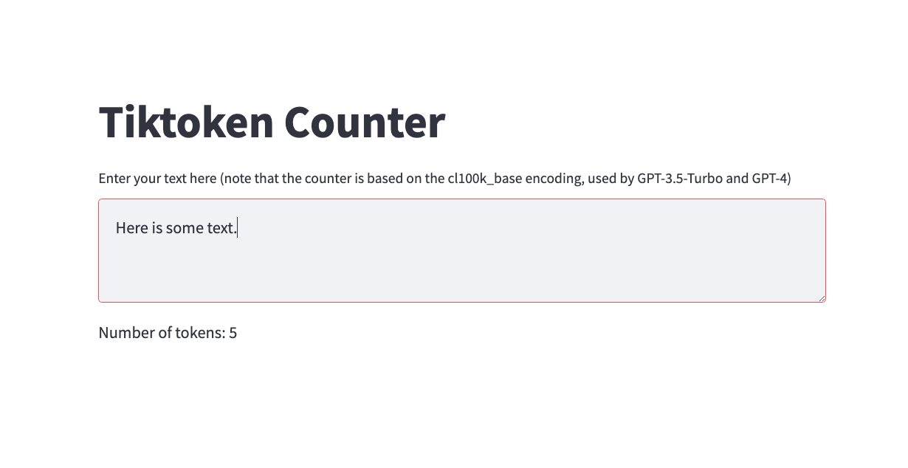

# Tiktoken-counter

A simple [streamlit](https://streamlit.io/) app that computes the number of [tiktokens](https://github.com/openai/openai-cookbook/blob/main/examples/How_to_count_tokens_with_tiktoken.ipynb) used by a fragment of text.

## Use the app

Web app available [here](https://albanie-tiktoken-counter-main-rdjp0k.streamlit.app/).

You can also run the app locally via:

```bash
streamlit run main.py
```

Looks like this:

